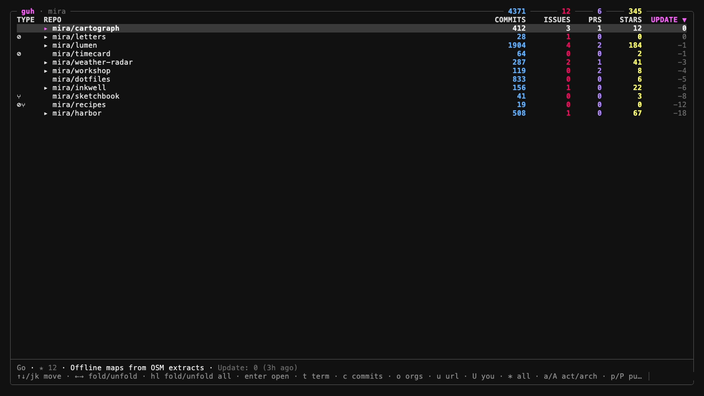

# guh

A terminal UI for the GitHub repos your `gh` session can see. Yours or an org: open issues and PRs, stars, last update. Fold a repo to read what's open, flip through recent commits, switch orgs without leaving the list.



Needs [GitHub CLI](https://cli.github.com/) authenticated (`gh auth login`). A TTY gets the interactive view; anything else dumps a table.

Homebrew (macOS):

```sh
brew tap astrostl/guh https://github.com/astrostl/guh
brew install guh
```

Go:

```sh
go install github.com/astrostl/guh@latest
```

`guh --demo` (or `-demo`) loads fake repos, issues, orgs, and commits. No `gh` session. Handy for screenshots.

| key | |
| --- | --- |
| `↑↓` `jk` | move |
| `←→` | fold / unfold the current repo |
| `h` `l` | fold / unfold all |
| `enter` | open in the browser |
| `c` | last 7 commits |
| `o` | switch org |
| `a` | clear visibility filters |
| `p` `P` | public / private |
| `f` `F` | sources / forks |
| `s` | cycle sort (update, name, issues, PRs, stars) |
| `/` | text filter |
| `?` | help |
| `q` | quit |

[](https://www.youtube.com/shorts/hj1N6vkOQDM)
